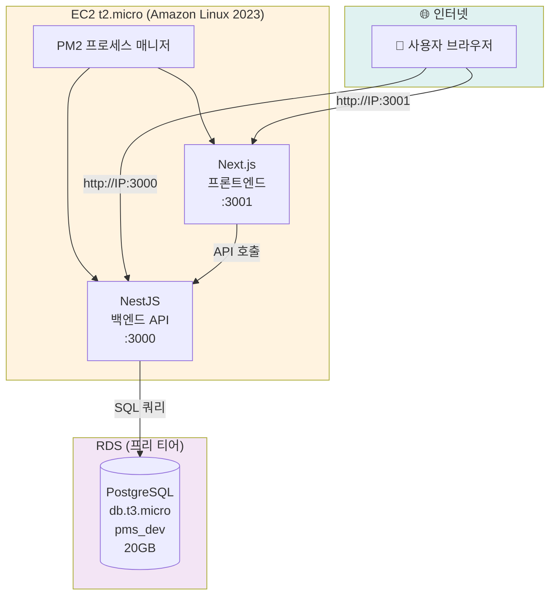
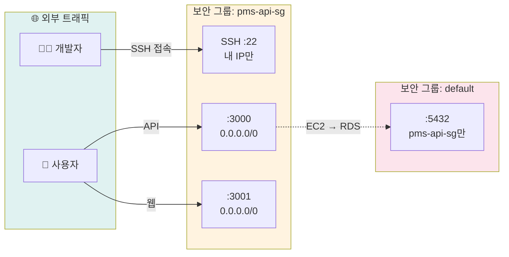
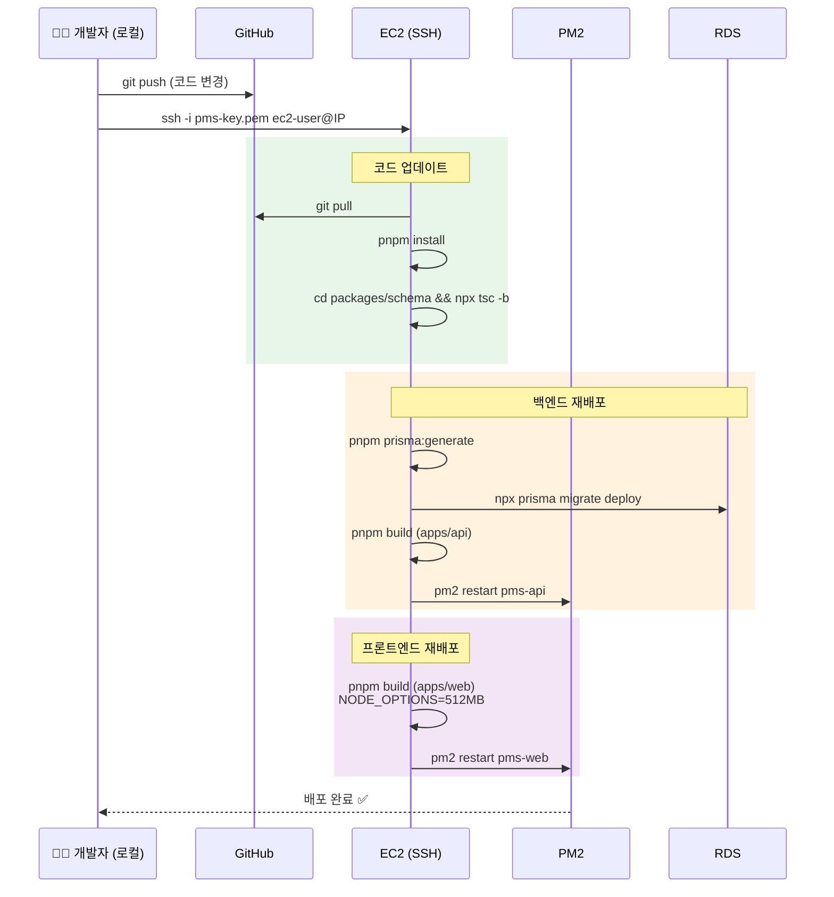
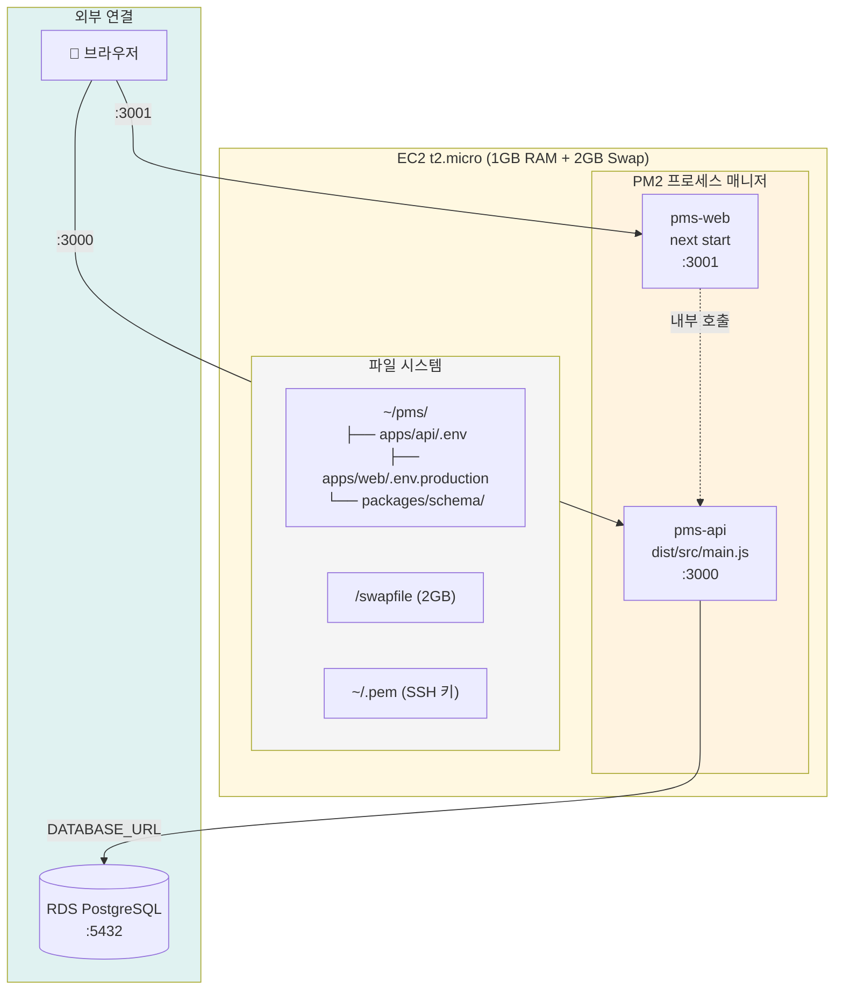

# AWS 배포 아키텍처 다이어그램

> EC2 프리 티어 기반 배포 구조를 Mermaid 다이어그램으로 정리한 문서입니다.
> [Mermaid Live Editor](https://mermaid.live)에서 미리보기 가능합니다.

---

## 1. 전체 인프라 구성도

---

## 2. EC2 보안 그룹 설정

---

## 3. 초기 배포 과정 (Step by Step)

```mermaid
flowchart TD
    A["0단계<br/>리전 확인<br/>서울 ap-northeast-2"] --> B

    subgraph Step1["1단계: RDS 생성"]
        B["RDS 콘솔 접속"] --> C["PostgreSQL 16.x<br/>프리 티어 선택"]
        C --> D["DB 인스턴스: pms-db<br/>사용자: postgres<br/>DB명: pms_dev"]
        D --> E["엔드포인트 복사<br/>→ DATABASE_URL에 사용"]
    end

    E --> F

    subgraph Step2["2단계: EC2 생성"]
        F["EC2 콘솔 접속"] --> G["Amazon Linux 2023<br/>t2.micro 선택"]
        G --> H["키 페어 생성<br/>pms-key.pem 다운로드"]
        H --> I["보안 그룹 설정<br/>:22, :3000, :3001 오픈"]
        I --> J["인스턴스 시작<br/>퍼블릭 IP 복사"]
    end

    J --> K

    subgraph Step3["3단계: RDS 보안 그룹"]
        K["RDS 보안 그룹 편집"] --> L["인바운드 규칙 추가<br/>PostgreSQL :5432<br/>소스: pms-api-sg"]
    end

    L --> M

    subgraph Step4["4단계: 백엔드 배포"]
        M["SSH 접속"] --> N["스왑 메모리 추가<br/>2GB (필수!)"]
        N --> O["Node.js, pnpm,<br/>PM2, git 설치"]
        O --> P["git clone → pnpm install"]
        P --> Q[".env 파일 작성<br/>DATABASE_URL, JWT_SECRET"]
        Q --> R["스키마 빌드 → Prisma 생성<br/>→ migrate → API 빌드"]
        R --> S["pm2 start dist/src/main.js"]
    end

    S --> T

    subgraph Step5["5단계: 프론트엔드 배포"]
        T["apps/web에서 빌드<br/>NODE_OPTIONS=512MB"]
        T --> U["pm2 start next :3001"]
        U --> V["pm2 save<br/>자동 재시작 설정"]
    end

    V --> W

    subgraph Step6["6단계: 요금 방지"]
        W["Budgets 알림 설정<br/>월 $1 초과 시 이메일"]
    end

    style Step1 fill:#e8f5e9
    style Step2 fill:#e3f2fd
    style Step3 fill:#fce4ec
    style Step4 fill:#fff3e0
    style Step5 fill:#f3e5f5
    style Step6 fill:#ffebee
```

---

## 4. 업데이트 배포 흐름

---

## 5. EC2 내부 프로세스 구조

